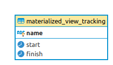

# Database Utilities

The queries here are meant to be general purpose utilities that can be re-used in any other project(s).

## [appschema](deploy/appschema.psql)

This migration creates a schema from a variable named ... "schema".  This is useful when you want to deploy migrations against one or more schemas.

### Example usage

```sh
# here were are setting a schema named test
sqitch deploy --set schema=test

# should we want to redeploy the same migrations in a different schema, we need to use a different sqitch registry
sqitch --registry new_registry deploy --set schema=test2
```

### Beware of the defaults

Please note that the migrations set the default schema to "test".

You need to change this to something else, or to "public" in case you do not wish to use a custom schema.

## [array_concat_agg](deploy/array_concat_agg.psql)

This is like aggregation works like `array_agg` but can work over arrays that have different dimensions.

The PostgreSQL ARRAY_AGG() function is an [aggregate function](https://www.postgresql.org/docs/9.5/functions-aggregate.html) that accepts a set of values and returns an array in which each value in the input set is assigned to an element of the array.  Crucially, its inputs must all have same dimensionality.

`array_concat_agg` works exactly the same, but accepts inputs that have differing dimensionality.

### Example

```sql
-- suppose we have this kind of data
select * from fancy_table;

-- name  |        cars
-- -------+--------------------
-- bob   | {toyota,vovlo}
-- susan | {bmw}
-- jane  | {nissan,ford,fiat}

select array_concat_agg(cars) as all_cars from fancy_table;

-- returns the combined/aggregated array of cars
--              all_cars
-- -------------------------------------
-- {toyota,vovlo,bmw,nissan,ford,fiat}
```

## [count_elements](deploy/count_elements.psql)

This function takes an array and returns a JSON object containing each of the array elements and its corresponding count.

For example:

```sql
select count_elements('{a, b, b}');

--     count_elements
-- ----------------------
--  { "b" : 2, "a" : 1 }

```

## [DATEDIFF](deploy/DateDiff.psql)

Utility to calculate the difference between 2 datetime values in seconds, minutes, hours, days, weeks, months and years in PostgreSQL.

```sql
SELECT DATEDIFF('second', '2011-12-30 08:54:55'::timestamp, '2011-12-30 08:56:10'::timestamp);
--- returns 75
```

## [Query utils](deploy/query_utils.psql)

### util_exception_query

This util function provides a way of retrieving the exception message of a dynamic query. This is particularly useful for making sure exceptions are raised for queries with strict constraints.

Example:

```sql
-- here is an example where you are checking that a "foreign key constraint" exception happens
SELECT 1/COUNT(*)
FROM util_exception_query(
$$
INSERT INTO staff_members (name, department_id)
VALUES (
    'Bob',
    66 -- this department does not exist in the departments table
)
$$) AS output
WHERE output ILIKE '%violates foreign key constraint%';
```

### util_explain_query

This util function provides a way of retrieving the output of EXPLAIN for a dynamic query. This is particularly useful to make sure that an index scan is being used when appropriate.

Example:

```sql
SELECT 1/COUNT(*)
   FROM util_explain_query($$SELECT name FROM ciemails WHERE email='my@email.com'$$) AS output
WHERE output LIKE '%Index Scan%';
```

## [refresh_mat_view](deploy/refresh_mat_views.psql)

This function is used to refresh materialized views and store information on when the refresh was started, and finished.  This is useful in situations where information is needed on when materialized views were last refreshed, and how much time the refresh took.

`refresh_mat_view` works by storing the information in a table named [materialized_view_tracking](deploy/materialized_view_tracking.psql).

```sql
-- example usage
SELECT refresh_mat_view('the_materialized_view_name', TRUE);

-- the materialized_view_tracking table would then look like this:
SELECT * FROM materialized_view_tracking;
--            name            |           start            |           finish
-- ---------------------------+----------------------------+----------------------------
--  targets_materialized_view | 2020-05-15 12:12:35.268613 | 2020-05-15 12:12:35.268613
--  reporting_lag             | 2020-05-15 12:12:50.902473 | 2020-05-15 12:12:50.902473
```

## [slugify](deploy/slugify.psql)

This is a simple function to, well, slugify strings.  Can be best described via examples:

```sql
-- returns values as expected
SELECT slugify('I Love Food');
-- 'i_love_food'

SELECT slugify('fooBar 123 $#%');
-- 'foobar_123'

SELECT slugify('  Déjà Vu!  ');
-- 'deja_vu'

SELECT slugify('I ♥ Dogs');
-- 'i_dogs'

-- works with a custom separator
SELECT slugify('foo and bar', '-');
-- 'foo-and-bar'

SELECT slugify('The lazy dog is fun!', '-');
-- 'the-lazy-dog-is-fun'
```

As you may have guessed by now the function takes two params:

1. The string to be slugified
2. The desired separator, the default is underscore (_)

## ERD

If these migrations are run, this is the resulting entity relationship diagram:


