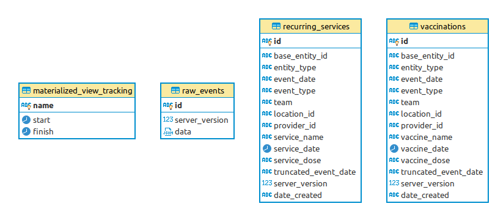

# OpenSRP Common Migrations

This directory is meant to hold database migrations that are meant for all OpenSRP projects.

## 1. Transaction Tables

The following tables' migrations are managed:

- [vaccinations](1-transaction-tables/deploy/vaccinations.psql)
- [recurring_service](1-transaction-tables/revert/recurring_service.psql)

## 2. Raw Tables

The following tables' migrations are managed:

- [raw_events](2-raw-tables/deploy/raw_events.psql)

These are meant to be used as raw data tables in according with the [Canopy connector guidelines](https://github.com/onaio/canopy/tree/master/docs/connectors#raw-data-storage).

## ERD

If these migrations are run, this is the resulting entity relationship diagram:

