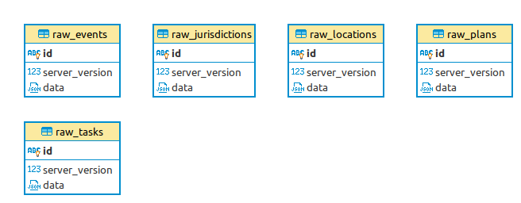

# Reveal Raw Tables

The following tables' migrations are managed:

- [raw_jurisdictions](deploy/raw_jurisdictions.psql): stores OpenSRP jurisdictions
- [raw_plans](deploy/raw_plans.psql): stores OpenSRP plans
- [raw_locations](deploy/raw_locations.psql): stores OpenSRP locations i.e. locations where `is_jurisdiction=False`
- [raw_tasks](deploy/raw_tasks.psql): stores OpenSRP tasks

These are meant to be used as raw data tables in according with the [Canopy connector guidelines](https://github.com/onaio/canopy/tree/master/docs/connectors#raw-data-storage).

## ERD

If these migrations are run, this is the resulting entity relationship diagram:

