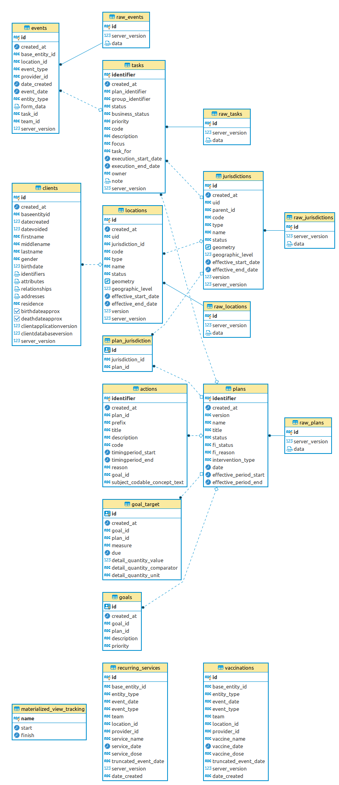

# Reveal Transaction Tables

Once data from OpenSRP has been received in [Reveal's raw tables](../1-raw_tables/README.md), it is then transformed and stored in so called "transaction" tables.  The transformation here is mainly some normalization to produce tables from the JSON received in "raw tables.

These are the resulting tables:

- [actions](deploy/actions.psql): stores plan actions
- [clients](deploy/clients.psql): stores clients
- [events](deploy/events.psql): stores events
- [goals](deploy/goals.psql): stores plan goals
- [goal_target](deploy/goal_target.psql): stores goal targets
- [jurisdictions](deploy/jurisdictions.psql): stores jurisdictions
- [plan_jurisdiction](deploy/plan_jurisdiction.psql): maps plans to jurisdictions
- [plans](deploy/plans.psql): stores plans
- [structures](deploy/structures.psql): stores structures
- [tasks](deploy/tasks.psql): stores tasks

## ERD

If these migrations are run, this is the resulting entity relationship diagram:

