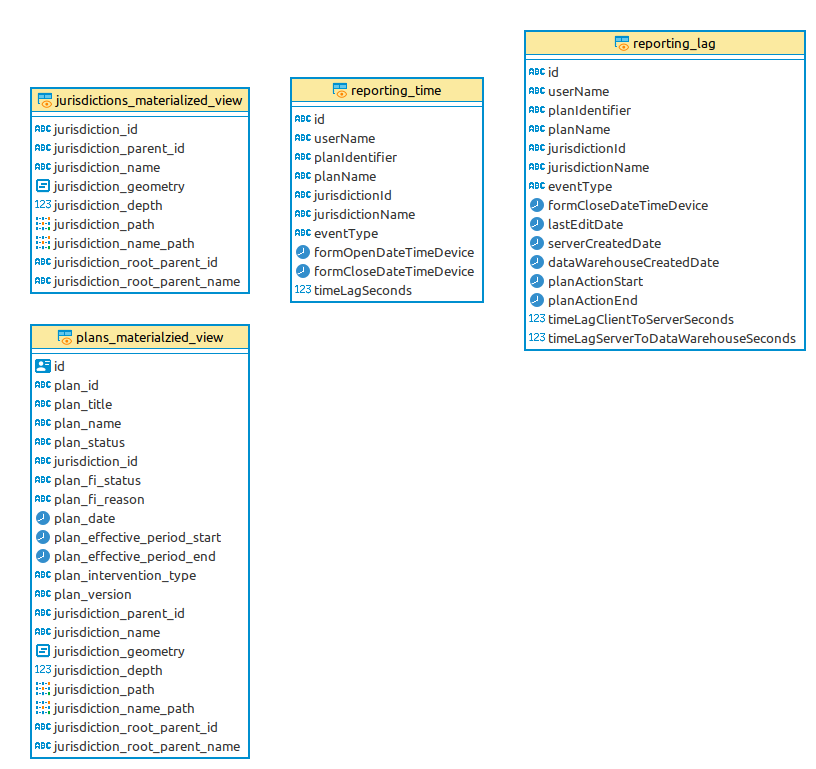

# Reveal Database Views

These are general purpose materialized views used almost everywhere:

- [jurisdictions_materialized_view](deploy/jurisdictions_materialized_view.psql): Holds data about all jurisdictions.  Each record in this view includes the jurisdiction hierarchy path for the jurisdiction in question.
- [plans_materialized_view](deploy/plans_materialized_view.psql): This view holds data that represents a plan-jurisdiction combination.  Each record in this view is unique by plan and jurisdiction combined.  It also includes the jurisdiction hierarchy on each record.
- [reporting_lag](deploy/reporting_lag.psql): This view exposes the amount of time it takes to get from the device to the OpenSRP server and then to the data warehouse per event.
- [reporting_time](deploy/reporting_time.psql): This view exposes the amount of time that a user takes to complete a form which should be form.save.date - last.edit.date.

## ERD

If these migrations are run, this is the resulting entity relationship diagram:

