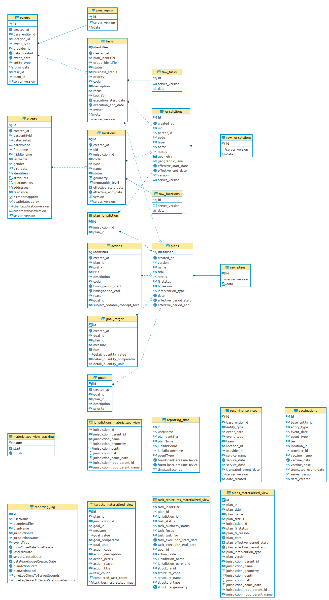

# Thailand Focus Investigation (FI)

The migrations in this section are meant to support Focus Investigation in Thailand.

## Thailand FI 2019

### Materialized Views

- [targets_materialized_view](deploy/targets_materialized_view.psql): Holds data about each goal in a plan.  Each record in this view is unique by goal, plan, and jurisdiction.  It also includes the task count and task business statuses counts for each goal-plan-jurisdiction combo
- [task_structures_materialized_view](deploy/task_structures_materialized_view.psql): In this view, each record is a unique task with additional action, jurisdiction, and structure data.

### Reveal Web Usage

For Thailand FI reports,The Reveal web UI makes use of the following tables and views:

- plans_materialized_view
- targets_materialized_view
- task_structures_materialized_view

### ERD

If these migrations are run, this is the resulting entity relationship diagram:

