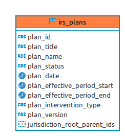

# Generic IRS migrations

These migrations are used generically for IRS.

## Materialized views

- [irs_plans](deploy/irs_plans.psql): This view conveniently exposes IRS plans with additional information needed for IRS reports in the Reveal web application.

## ERD

If these migrations are run, this is the resulting entity relationship diagram:

