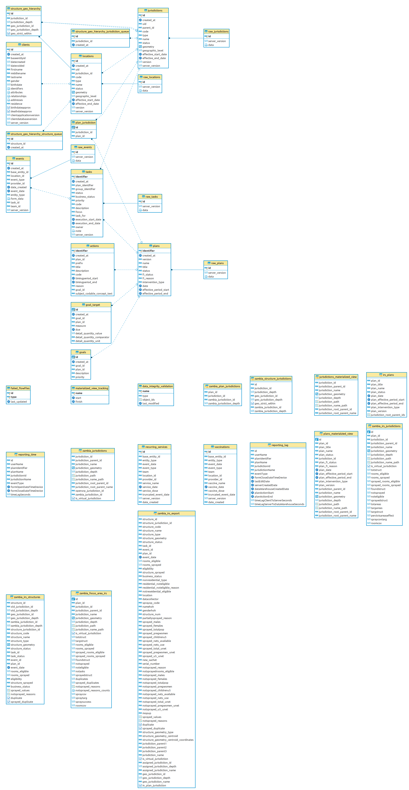

# Zambia 2019 IRS Migrations

These migrations are to support IRS in Zambia for the 2019 season.

## Tables

- [structure_geo_hierarchy](deploy/structure_geo_hierarchy.psql):  Stores the geographic location of structures.
- [structure_geo_hierarchy_queue](deploy/structure_geo_hierarchy_queue.psql)
  - **structure_geo_hierarchy_structure_queue**: acts as a queue for structures to be processed into the `structure_geo_hierarchy` table
  - **structure_geo_hierarchy_jurisdiction_queue**: acts as a queue for jurisdictions whose structures need to be processed into the `structure_geo_hierarchy` table

## Functions

### 1. [create_structure_geo_hierarchy](deploy/create_structure_geo_hierarchy.psql)

This function takes a structure (from the structures table) and determines which jurisdiction the structure is located in geographically.  It then inserts a record in the structure_geo_hierarchy table with this information.

```sql
-- for one or some structures just use a condition
SELECT create_structure_geo_hierarchy(structures.*) FROM structures where id = '123';
-- for all structures (this is expensive!)
SELECT create_structure_geo_hierarchy(structures.*) FROM structures;
```

### 2. [structure_geo_hierarchy_triggers](deploy/structure_geo_hierarchy_triggers.psql)

These triggers populate the `structure_geo_hierarchy_structure_queue` and `structure_geo_hierarchy_jurisdiction_queue` tables.

- **process_structure_geo_hierarchy_trigger**: adds a structure to the structure_geo_hierarchy_structure_queue.  Runs after insert or update on the structures table.
- **jurisdiction_create_structure_geo_hierarchy_trigger**: adds a jurisdiction to the structure_geo_hierarchy_jurisdiction_queue table after insert or update on the jurisdictions table

### 3. [process_structure_geo_hierarchy_queue](deploy/process_structure_geo_hierarchy_queue.psql)

These functions process entries in the `structure_geo_hierarchy_structure_queue` and `structure_geo_hierarchy_jurisdiction_queue` tables.  They are meant to be run periodically to ensure that the queues are processed.

#### a. process_structure_geo_hierarchy_structure_queue

This function processes all the structures in the structure_geo_hierarchy_structure_queue table.

```sql
-- by default it processes 1000 structures at a time
SELECT process_structure_geo_hierarchy_structure_queue();
-- to process 50 structures at a time
SELECT process_structure_geo_hierarchy_structure_queue(50);
```

#### b. process_structure_geo_hierarchy_jurisdiction_queue

This function processes all jurisdictions in the structure_geo_hierarchy_jurisdiction_queue table.  When we have jurisdictions in the queue, we are forced to reprocess all structures because any change in even one jurisdiction's geometry means that all structures might need to be reprocessed.

Therefore, this function (re)processes all the structures in the structures table.

WARNING: this is an expensive query!!

```sql
-- as noted above, this is potentially very expensive
SELECT process_structure_geo_hierarchy_jurisdiction_queue();
```

## Materialized views

- [zambia_focus_area_irs](deploy/zambia_focus_area_irs.psql): exposes IRS metrics calculated for focus areas
- [zambia_irs_export](deploy/zambia_irs_export.psql): adds additional information to the zambia_irs_structures view.  It is meant to be a mechanism for data export.
- [zambia_irs_jurisdictions](deploy/zambia_irs_jurisdictions.psql):  exposes IRS metrics calculated for jurisdictions other than focus areas
- [zambia_irs_structures](deploy/zambia_irs_structures.psql): exposes IRS metrics calculated for individual structures

### Virtual "remainder" jurisdictions

These views add support for "virtual" jurisdictions.  These jurisdictions result from the fact that some structures do not fall into any known jurisdictions but yet IRS activities were carried out at such structures.  For reporting purposes, it is then necessary to tie these structures to "virtual jurisdictions".

- [zambia_jurisdictions](deploy/zambia_jurisdictions.psql)
- [zambia_plan_jurisdictions](deploy/zambia_plan_jurisdictions.psql)
- [zambia_structure_jurisdictions](deploy/zambia_structure_jurisdictions.psql)

## Reveal Web Usage

For Zambia IRS reports,The Reveal web UI makes use of the following tables and views:

- irs_plans: this is for displaying the initial list of IRS plans in the IRS reporting section
- zambia_irs_jurisdictions: this powers the jurisdictions hierarchy in the IRS reporting section
- zambia_focus_area_irs: this powers the lowest level of the jurisdictions hierarchy in the IRS reporting section
- zambia_irs_structures: this is for displaying the structures on the IRS reporting map

### ERD

If these migrations are run, this is the resulting entity relationship diagram:


