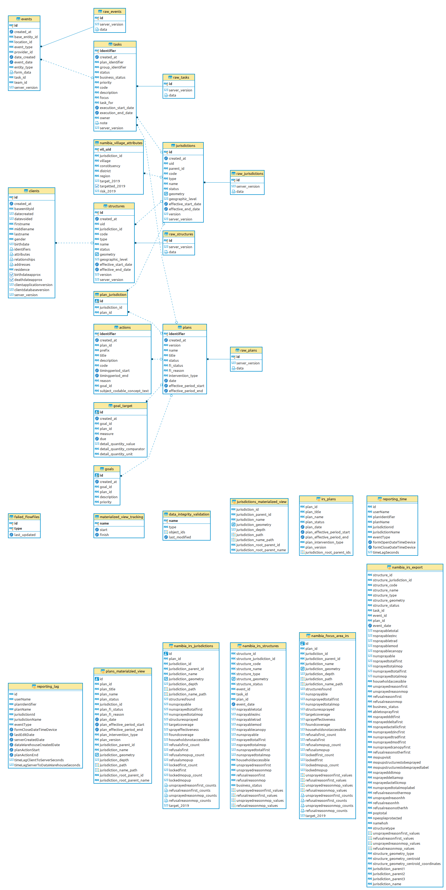

# Namibia 2019 IRS Migrations

These migrations are to support IRS in Namibia for the 2019 season.

## Tables

- [namibia_village_attributes](deploy/namibia_village_attributes.psql): stores village attributes for Namibia

## Materialized Views

- [namibia_focus_area_irs](deploy/namibia_focus_area_irs.psql): exposes IRS metrics calculated for focus areas
- [namibia_irs_export](deploy/namibia_irs_export.psql): adds additional information to the namibia_irs_structures view.  It is meant to be a mechanism for data export.
- [namibia_irs_jurisdictions](deploy/namibia_irs_jurisdictions.psql): exposes IRS metrics calculated for all jurisdictions (uses namibia_focus_area_irs to do this)
- [namibia_irs_structures](deploy/namibia_irs_structures.psql): exposes IRS metrics calculated for individual structures

## Reveal Web Usage

For Namibia IRS reports,The Reveal web UI makes use of the following tables and views:

- irs_plans: this is for displaying the initial list of IRS plans in the IRS reporting section
- namibia_irs_jurisdictions: this powers the jurisdictions hierarchy in the IRS reporting section
- namibia_irs_structures: this is for displaying the structures on the IRS reporting map

### ERD

If these migrations are run, this is the resulting entity relationship diagram:

